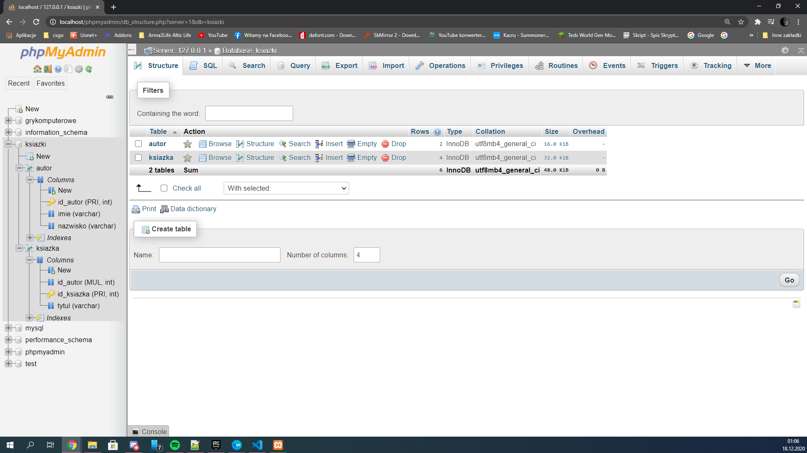
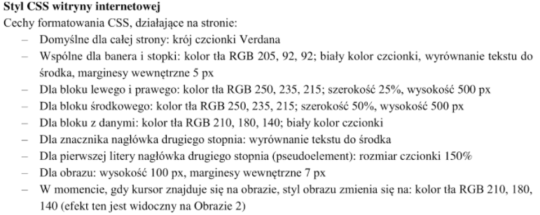
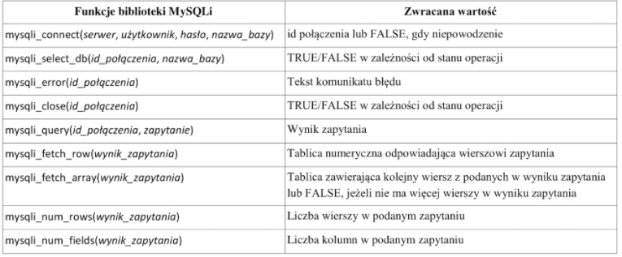
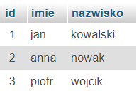

**EE09 w skrócie**
W zasadzie egzamin to wypisane kroki prowadzące do zrobienia strony(po drodze jakiś sql, grafika)
> **Uwaga:** nie zawsze te kroki są po kolei ważne jest żeby przeczytać uważnie cały arkusz a dopiero zacząć robić
bo jeżeli na końcu jest napisane zrób plik dupa.txt wpisz do niego swoje imie i nazwisko a to wystarczy by zaliczyć egzamin to na huj już masz stronę zrobioną

Kolejnym krokiem jest rozpakowanie pliku `egzamin(numer).zip` do folderu z swoim numerem PESEL

We wszystkich arkuszach pierwszym zadaniem jest import bazy a potem screenowanie tego **Uwaga:** jest w huj wyraźnie napisane jak zrobić screena, pod jaką nazwą go zapisać i z jakim formatem np.
> Wykonaj zrzut ekranu po imporcie. Zrzut zapisz w formacie **JPEG** o nazwie **egzamin**, w folderze opisanym numerem pesel. Nie kadruj zrzutu. Zrzut powinien obejmować cały ekran monitora, z widocznym paskiem zadań. Na zrzucie powinny być widoczne elementy wskazujące na poprawnie wykonany import.
**Uwaga:** Jest to w ZO(zasady oceniania) że ma być w danym formacie, więc teoretycznie musi się dojebać do tego.
Co to oznacza? po imporcie z strony głównej PHPmyadmin wybrać zrobioną bazę i wyskoczy nam tabela z strukturą bazy, dodatkowo można sobie z lewej strony rozwinąć tabele oraz kolumny jakie się w niej znajdują wtedy mamy 100% pewności że widać poprawny import na jednym screenie.
Dokładnie coś takiego

Gdy baza jest już gotowa i zescreenowana chcą żeby wykonać 4 zapytania na tej bazie.
> **Uwaga:** Chcą żeby zapisać to w pliku `kwerendy.txt` ale też zrobić screena z działania o nazwie `kw1.jpg, kw2.jpg, kw3.jpg, kw4.jpg`
***ZAJEBIŚCIE WAŻNE*** Plik `JPG` i `JPEG` to niby to samo ale jak gość będzie upierdliwy to się dopierdoli, ale nie zawsze jest to w zasadach oceniania więc może nie mieć podstaw.
**Info z ZO:** wystarczy że masz plik `kwerendy.txt`i conajmniej jedno zapytanie wynikające z treści zadania a masz już punkt, *nie jest napisane że ma działać ma być*, ale musi mieć podobną strukturę jak przykład w zo
**Info z ZO:** jeżeli nie jest napisane na arkuszy jak mają być zapisane kwerendy w pliku to najlepiej zrobić to tak jak jest w poleceniu na innych arkuszach(np. e14)
```txt
zapytanie 1: ..zapytanie..
zapytanie 2: ..zapytanie..
zapytanie 3: ..zapytanie..
zapytanie 4: ..zapytanie..
```
egzaminator pod tym względem nie ma do czego się dojebać
**Ciekawostka:** wystarczy tylko jedno zapytanie w txt, ale wszystkie muszą być na screenach, *egzaminator sprawdza czy wynik zapytania na screenie jest ok z tym co ma w ZO.* - ful punkty za hujowo zrobione zadanie
``` ```
**Budowa Strony**
Wszystko jest ładnie napisane co ma być i jak ma być, to co jest zawsze to,
- nazwa piku np. `wycieczki.php`
- standard polskich znaków
- tytuł strony
- podłączony css
- napisane na jakie bloki ma być podzielna strona
Dalej wypisana jest **Zawartość strony**
Następnie **CSS**
potem **PHP** *lub* **JavaScript(JS)**
Plik `nazwa.php/html`
```html
<html lang="pl-PL"><!-- lang="pl-PL", standard polskich znaków-->
  <head>
    <meta charset="UTF-8"><!--standard polskich znaków-->
    <title>Tytuł strony</title><!--tytuł strony wyświetlany na pasku okna przeglądarki-->
    <link rel="stylesheet" href="plik.css"><!--Podłączenie css-->
  </head>
  <body>
    <!-- zawartość strony-->
  </body>
</html>
```
**Przykładowy podział strony na bloki**(arkusz 2 wiosna 2020)

> przed zadanie ze screena wynika że jest podział na 4 bloki poziome i jeden z tych bloków jest podzielony na 3, to jest przedstawione dalej w zadaniu

**Info z ZO:** Punktowana jest nazwa pliku, kodowanie znaków, tytułu strony, wygląd(podział na bloki), umieszczonych danych, i w tym wypadku umieszczenie tabeli
Realizacja

```html
<body>
    <div id="banner">

    </div>
    <div id="zawartosc">
      <div id="blok_lewy">

      </div>
      <div id="blok_srodek">

      </div>
      <div id="blok_prawy">

      </div>
    </div>
    <div id="dane">

    </div>
    <div id="stopka">

    </div>
  </body>
```
`Zawartość strony`
> Dosłownie wpisanie to co chcą do konkretnych bloków
```html
<!DOCTYPE html>
<html lang="pl-PL">
  <head>
    <meta charset="utf-8">
    <title>Wycieczki i urlopy</title>
    <link rel="stylesheet" href="styl3.css">
  </head>
  <body>
    <div id="banner">
      <h1>BIURO PODRÓŻY</h1><!-- nagłówek pierwszego stopnia o treści "BIURO PODRÓŻY"-->
    </div>
    <div id="zawartosc">
      <div id="blok_lewy">
        <!-- nagłówek drugiego stopnai o treści "KONTAKT"-->
        <h2>KONTAKT</h2>
        <!--Odnośnik do adresu email biuro@wycieczki.pl o treści "napisz do nas" -->
        <a href="mailto:biuro@wycieczki.pl">napisz do nas</a>
        <!-- Paragraf (akapit) o treści "telefon: 555666777" -->
        <p>telefon: 555666777</p>
      </div>
      <div id="blok_srodek">
        <!-- nagłówek drugiego stopnia o treści "GALERIA"-->
        <h2>GALERIA</h2>
        <!-- Działanie skryptu 1 -->

      </div>
      <div id="blok_prawy">
        <!-- nagłówek drugiego stopnia o treści "PROMOCJE"-->
        <h2>PROMOCJE</h2>
        <!-- Tabela z danymi, trzy kolumne dwa wiersze-->
        <table>
          <tr><!-- wiersz tabeli -->
            <td>Jeśeń</td> <!-- kolumna tabeli -->
            <td>Grupa 4+</td>
            <td>Grupa 10+</td>
          </tr>
          <tr>
            <td>5%</td>
            <td>10%</td>
            <td>15%</td>
          </tr>
        </table>
      </div>
    </div>
    <div id="dane">
      <!-- Nagłówek drugiego stopnia -->
      <h2>LISTA WYCIECZEK</h2>
      <!-- Działanie skryptu 2 -->

    </div>
    <div id="stopka">
      <p>Stronę wykonał: 00000000000</p>
    </div>
  </body>
</html>
```
`Realizacja układu strony w css`
Poprzednio utworzone bloki trzeba ustawić tak jak są one pokazane na screenie
`Realizacja wyśrodkowania body na stronie`
```css
html{
  width: 100%;/* Szerokość max*/
}
body{
  width:  100%; /*Szerokość najlepiej to co jest podana w arkuszu jak nie ma to 100% */
  margin-left: auto;
  margin-right: auto;
}
```
`układ bloków poziomych` 
bloki domyślnie układają się poziomo jeden pod drugim z tego powodu początkowo dzielimy stronę na bloki poziome czyli kolejno nagłówek(baner jak zwał tak zwał), content(tu podzielony na 3 kolumny), oraz stopkę, każdy z tych bloków powinien mieć szerokość 100% oraz wysokości podane w arkuszu.
**Uwaga**: tu akurat strona podzielona jest na 4 bloki pionowe.
zrobienie tego css'a jest łatwe (tu dalej przykład arkusz nr2 wiosna 2020) na podstawie bloków stworzonych wcześniej
```css
/*Wcześniej napisany css*/
#banner {
  width: 100%;
  height: auto;/*w tym arkuszu nie podane, nie trzeba tej linijki w ogóle pisać albo jestem ślepy, też jest taka opcja*/
}
#zawartosc{
  width: 100%;
  height: 500px;/* w tym wypadku podany jest rozmiar bloków wewnętrznych, można ale nie trzeba pisać tej linijki bo wysokość wtedy jest auto i będzie taka sama jak to co jest w środku*/
}
#dane{
  width: 100%;
  height: auto;/* tu nie podany*/
}
#stopka{
  width: 100%;
  height: auto;/* tu nie podany*/
}
```

`układ bloków pionowych w jednym bloku poziomym`
tu rozwiązanie jest bardzo proste, dla bloku rodzica- nadrzędnego- w tym wypadku zawartosc ustawiamy display na flex

```css
#zawartosc{
  display: flex;  
}
```
oraz dla wszystkich bloków znajdujących się w bloku zawartość ustawiamy szerokość w procentach
```css
#blok_lewy{
  width: 25%;
  height: 500px; /* w arkuszu podana jest wysokość ważne jest by ją dodać*/
}
#blok_prawy{
  width: 25%;
  height: 500px; /* w arkuszu podana jest wysokość ważne jest by ją dodać*/
}
#blok_srodek{
  width: 50%;
  height: 500px; /* w arkuszu podana jest wysokość ważne jest by ją dodać*/
}
```
**Info z ZO:** istotne są wysokości oraz szerokości elementów ponieważ nie posiadanie jednej z 3 szerokości lub wysokości usuwa nam jeden punkt.
Teraz pozostaje wypełnienie cssa resztą danych z arkusza

Tu też należy pamiętać o tym żeby robić wszystko po kolei biorąc pod uwagę wcześniej stworzoną strukturę strony.
**ProTips**
aby odnieść się do całej strony można skorzystać z elementu * np. (równie dobrze można wpisać html lub body ale * będzie najlepsze)
```css
* {
font-family: Verdana;
}
```
Nie trzeba przekształcać RGB na HEX wystarczy skorzystać z wbudowanej w css funkcji `rbg(red, green, blue)`
```css
element {
  background-color: rgb(255, 255, 255);
}
```
Zmieniający się styl elementu po najechaniu go myszką tworzy się z selektora elementu oraz `:hover` np.
```css
#banner{
  background-color: white;
}
#banner:hover{
  background-color: blue;
}
/* tu po najehaniu tło bannera zmieni się na niebieskie, tak nie jest w arkszu jak cos tylko przykład*/ 
```
Licząc na to że podstawy cssa znacie i dacie sobie radę z ustawieniem koloru tła czy czcionki pora na
`Skrypt połączenia z baząw PHP`
Opiszę krok po kroku jak wywołuje się zapytania jak pozyskuje dane i w jaki sposób z nich korzystać.
na początek połączenie z samą bazą danych
na dole egzaminu podana jest tabela z niezbędnymi funkcjami do obsługi zapytań sql

Nie ma potrzeby obsługi błędu z wykonywaniem jakiejkolwiek czynności więc tego nie robię, biorąc pod uwagę że upewnisz się ze 30 razy że dane do bazy są poprawne 
login: "root", hasło: "", adres(w tej tabelce jest kurwa serwer napisane ale ok): tu może być localhost lub 127.0.0.1, local host wywala czasem problem nie wiedzieć czemu(znaczy wiem ale nie o tym to)
```php
<?php
  $connection = mysqli_connect("127.0.0.1", "root", "", "baza_danych");
?>
```
**ProTip:** kod php można umieścić w dowolnym miejscu w html pamiętając o dodaniu `<?php /* kod */ ?>`
***Uwaga ISTOTNE W HUJ***: na koniec skryptu zawsze, ale to **ZAWSZE** trzeba dodać `mysqli_close($connection);` bez tego tracisz jeden free punkt.(to że w skrypcie ma być zamknięcie połączenia jest nawet napisane w akruszu)
Dalej, przygotowanie zapytania i wywołanie go, najlepiej jest sobie zrobić zmienną `$zapytanie` i tam je sobie przygotować a następnie wywołać funkcję `mysqli_query($connection, $zapytanie)` zapisując zwróconą wartość do `$result`
```php
<?php
  $connection = mysqli_connect("127.0.0.1", "root", "", "baza_danych");
  $zapytanie = "SELECT * FROM test";
  $result = mysqli_query($connection, $zapytanie);
?>
```
`$result` nie zawiera danych które możemy jakkolwiek jeszcze wykorzystać, jest to tylko wynik naszego zapytania który trzeba w odpowiedni sposób zinterpretować
Jak to zrobić ? i jak to działa ?
istotną funkcją w interpretacji danych jest funkcja `mysqli_num_rows($result)` która zwraca liczbę wierszy czyli ilość kolejnych rekordów z wywołanego zapytania, przykładowo jeżeli wywołaliśmy `SELECT * FORM Klienci` i mamy 10 klientów to zwraca liczbę 10.
Co nam to daje ?
pomaga to w stworzeniu pętli do analizy/wyświetlania danych na stronie np.
```php
<?php
  $connection = mysqli_connect("127.0.0.1", "root", "", "baza_danych");
  $zapytanie = "SELECT * FROM Klienci";
  $result = mysqli_query($connection, $zapytanie);
  for($i=0; i<mysqli_num_rows($result); $i++){
  //analiza/wyświetlanie danych ale to zaraz
  }
?>
```
pętla ta wykona się dokładnie tyle razy ile jest wierszy w wyniku zapytania
Teraz najważniejsze dane z zapytania analizowane są wiersz po wierszu, za każdym razem tworząc zależnie od wybranej funkcji tablicę zwykłą lub asocjacyjną z wiersza.
**ProTip:** Nie używajcie `mysqli_fetch_row()`, ta funkcja dla was nie istnieje używajcie `$row = mysqli_fetch_array($result)`, dzieki temu możecie korzystać zarówno z `$row['nazwa_kolumny']` jaki i `$row[0]`
Na potrzeby testów zrobiłem prostą tabelę o nazwie Klienci z kolumnami `id`, `imie`, `nazwisko`

Teraz jak kolejno wyświetlić tych klientów na dwa różne sposoby i jak to się kolejno odbywa
```php
<?php
  $connection = mysqli_connect("127.0.0.1", "root", "", "baza_danych");
  $zapytanie = "SELECT * FROM Klienci";
  $result = mysqli_query($connection, $zapytanie);
  for($i=0; i<mysqli_num_rows($result); $i++){
    $row = mysqli_fetch_array($result);//W każdej kolejnej iteracji pętli wczytywany jest kolejny wiersz do tablicy
    //teraz do dyspozycji mamy tabelę z danymi z danego wiersza więc można tu zrobić echo i wypisać tych klientów
    echo "Klient o id ". $row['id'] ." - ".$row['imie']." ".$row['nazwisko']."<br>";
  }
?>
```
W efekcie dostajemy
`Klient o id 1 - jan kowalski`
`Klient o id 2 - anna nowak`
`Klient o id 3 - piotr wojcik`
Ten sam efekt uzyskamy zmieniając linijkę echo na taką
```php
echo "Klient o id ". $row[0] ." - ".$row[1]." ".$row[2]."<br>";
```
Można też dowolnie mieszać ale lepiej tego nie robić bo sie może pojebać np.
```php
echo "Klient o id ". $row[0] ." - ".$row['imie']." ".$row[2]."<br>";
```
output będzie ten sam we wszystkich przypadkach
**ZJEBIŚCIE ISTOTNE:** zamknij te połączenie z bazą danych
